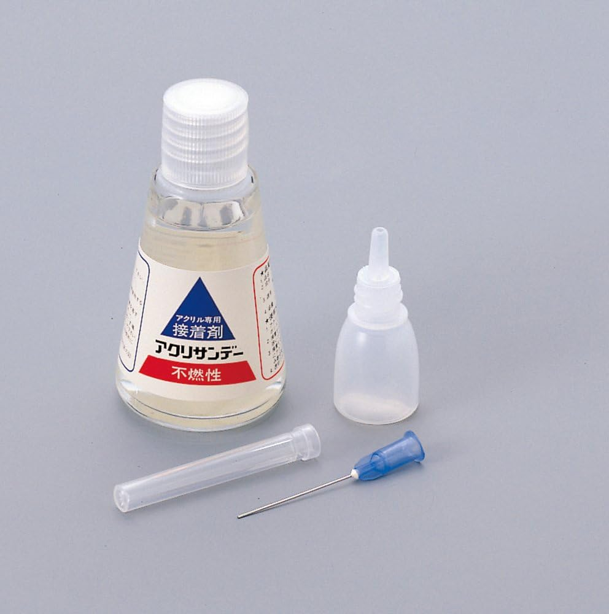

## Process
+ ref : [Youtube](https://www.youtube.com/watch?v=RkdblzqHemA)
+ プリント $\rightarrow$ ポリエステルパテ $\rightarrow$ 溶きパテ $\rightarrow$ サーフェーサー $\rightarrow$ 塗料 $\rightarrow$ トップコート

## Tools
+ PLA接着剤
  - [link](https://www.amazon.co.jp/gp/product/B00940PF0W/ref=ppx_yo_dt_b_search_asin_title?ie=UTF8&psc=1)
  -   
  - 砕いたサポート材を入れてドロドロにするとより塗りやすくなる[ref](https://www.youtube.com/watch?v=f2slsglqdaY)

+ ポリエステルパテ
  - [link](https://www.amazon.co.jp/dp/B0C8BGYTTS?ref=ppx_yo2ov_dt_b_fed_asin_title)
  - 