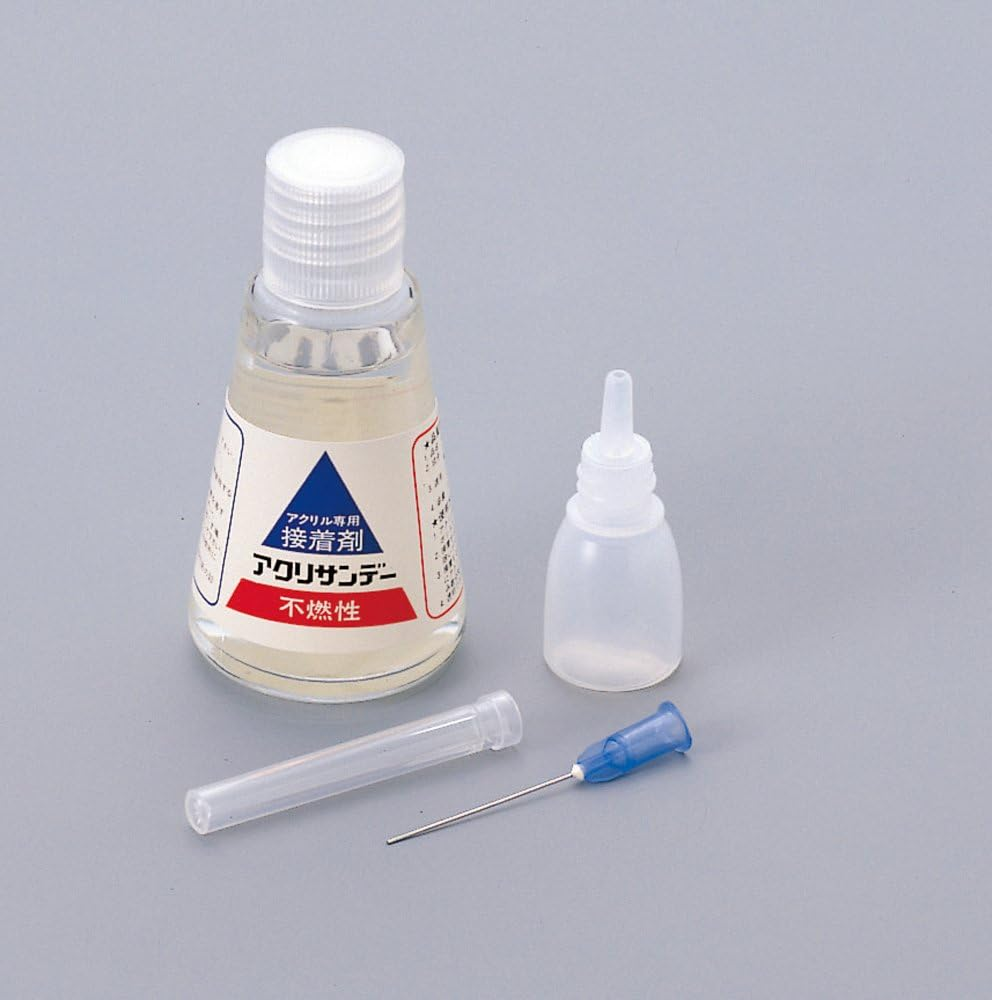
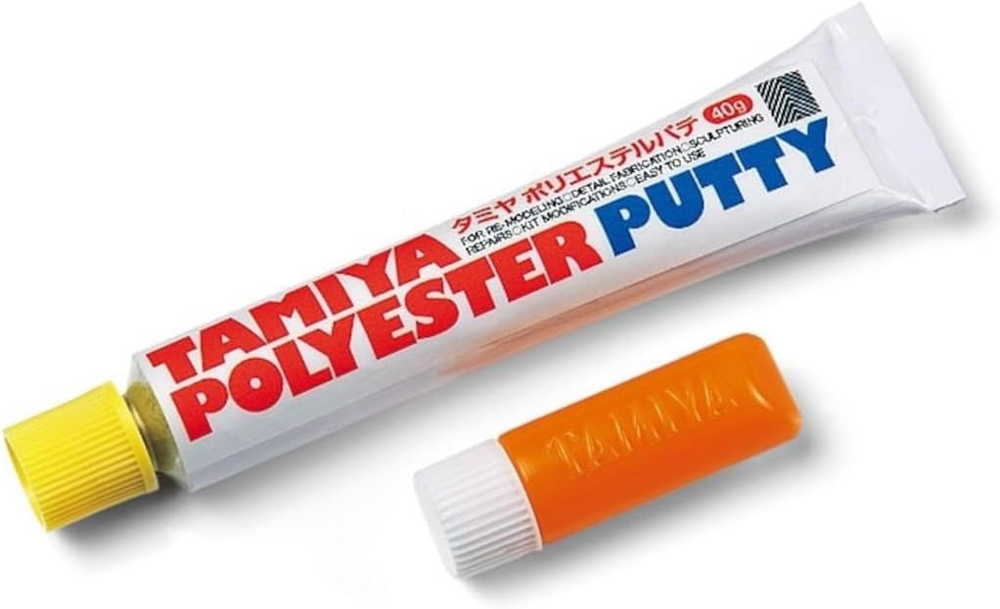

## Tools
+ PLA接着剤
[link](https://www.amazon.co.jp/gp/product/B00940PF0W/ref=ppx_yo_dt_b_search_asin_title?ie=UTF8&psc=1)

+ パテ
[link](https://www.amazon.co.jp/dp/B0C8BGYTTS?ref=ppx_yo2ov_dt_b_fed_asin_title)
