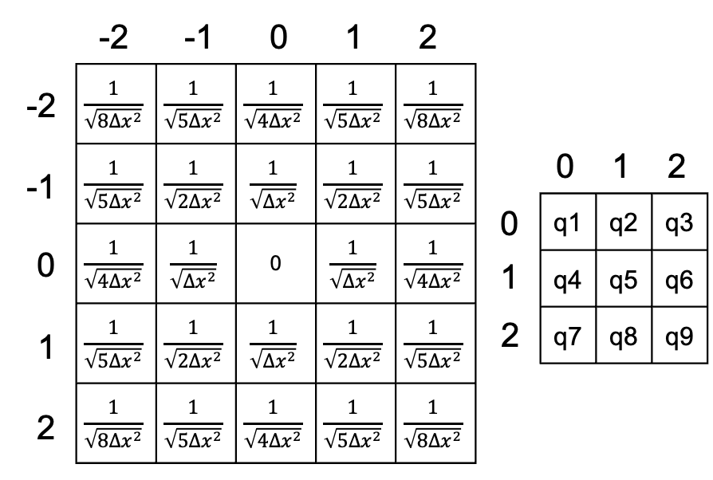

<script async src="https://cdn.jsdelivr.net/npm/mathjax@3/es5/tex-chtml.js" id="MathJax-script"></script>
<script>
MathJax = {
  tex: {
    inlineMath: [['$', '$'],['\$', '\$']]
  }
};
</script>

对于定义在规则网格中点电荷所产生的电势，可以使用谱方法求解。  

举例来说，对于3x3的二维网格，某一格点(j,i)处的电势p可以表示为格林矩阵G和电荷矩阵q的卷积：

$$
p[j][i]=\sum_{y=0}^{2} \sum_{x=0}^{2}  G[j-y][i-x] q[y][x]
$$

矩阵G和q如下图所示：




矩阵G为格点的格林函数的关于0,0位置的两次镜像。
根据[卷积定理](https://en.wikipedia.org/wiki/Convolution_theorem)，时空间的卷积等效于谱空间的hadamard product，因此上式可以改写为：

$$
p[j][i]=\mathscr{F}^{-1}(\mathscr{F}(G[j][i]) \circ \mathscr{F}(q[j][i]))
$$

需要注意的是：

+ 这里的卷积在边缘是不padding的，也就是valid convolution。假设q的尺寸是NxN，那么G的尺寸就应该是(2N-1)x(2N-1)，二者的valid卷积后的尺寸刚好就是NxN，即卷积后0,0位置的值对应着q1处受到的电势。
+ 对于通常的边缘padding的卷积，使用dft后的谱空间乘法相当于时空间的[循环卷积](https://en.wikipedia.org/wiki/Circular_convolution)，需要对两个时空间的函数都进行padding。然而在这个例子中，我们需要的结果的尺寸是小于G的，所以只需要padding电荷矩阵到G的大小就行。
+ G中索引为正的部分的意义是，表示网格中任意两点距离的所有可能情况。而存在负索引的部分只是为了满足卷积的定义而做的镜像。

以上是source网格和target网格为同一网格的情况。若source和target存在一个offset，则需要将G矩阵进行偏移。方法是对在计算G之前生成的镜像格点坐标矩阵的每个元素减去这个offset。

示例代码如下：

```python
import numpy as np
from scipy import signal
import matplotlib.pyplot as plt
import random

def preety_print(a):
    for row in a:
        for item in row:
            print("{:8.3f}".format(item), end = " ")
        print("")

def print_matrix(name, m):
    print(name, '=')
    preety_print(m)

def padding(xs, p):
    res = []
    for x in xs:
        y = [v for v in x]
        res.append(y + [0] * p)
    for _ in range(p):
        res.append([0] * (len(xs) + p))
    return np.array(res)

def get_conv_image(xs, offset):
    N = len(xs)
    img = np.lib.pad(xs,((N-1,0),(N-1,0)),'reflect')
    for j in range(2 * N - 1):
        for i in range(2 * N - 1):
            if j < N - 1:
                v = img[j][i]
                img[j][i] = complex(-v.real, v.imag)
            if i < N - 1:
                v = img[j][i]
                img[j][i] = complex(v.real, -v.imag)
    img -= offset
    return img

def naive(qs, xs, offset):
    N = len(qs)
    qs = qs.flatten()
    xs = xs.flatten()
    ps = np.zeros(N * N)
    for j in range(N * N):
        p = 0
        xj = xs[j]
        for i in range(N * N):
            xi = xs[i] + offset
            qi = qs[i]
            dx = np.abs(xi - xj)
            if dx > 0:
                p += qi / dx
        ps[j] = p
    return ps.reshape(N,N)

np.set_printoptions(precision=2)
np.set_printoptions(suppress=True)

err_cns = []
err_nfs = []
err_cfs = []
if __name__ == '__main__':
    M = 100
    for cnt in range(M):
        N = random.randint(3,32)
        #N = 5
        dx = 1.0
        offset = complex(random.uniform(-10,10),random.uniform(-10,10))
        qs = np.random.uniform(low=-1, high=1, size=(N,N)) #电荷矩阵
        xs = np.zeros([N,N], dtype=complex)
        for j in range(N):
            for i in range(N):
                xs[j][i] = complex(j,i) * dx

        ps_naive = naive(qs, xs, offset)
        #print_matrix('ps_naive', ps_naive)

        #偏移offset的镜像格点坐标矩阵
        img = get_conv_image(xs, offset) 
        dist = np.abs(img)
        #格林矩阵
        rs = np.reciprocal(dist,where=np.abs(dist)>1e-10) 
        ps_conv = signal.convolve2d(rs, qs, 'valid')
        #print_matrix('ps_conv', ps_conv)

        valid_size = len(rs) - len(qs) + 1
        qs_padding = padding(qs, len(rs) - len(qs))
        qsk = np.fft.fft2(qs_padding)
        rsk = np.fft.fft2(rs)
        psk = np.multiply(qsk, rsk)
        ps_fft = np.fft.ifft2(psk).real[-valid_size:,-valid_size:]
        #print_matrix('ps_fft',ps_fft)

        err_cn = np.linalg.norm(ps_conv - ps_naive) / N / N
        err_cf = np.linalg.norm(ps_conv - ps_fft) / N / N
        err_nf = np.linalg.norm(ps_naive - ps_fft) / N / N
        print(f'{cnt} N = {N}, offset = {offset}, err_cn = {err_cn}, err_nf = {err_nf}, err_cf = {err_cf}')
        err_cns.append(err_cn)
        err_nfs.append(err_nf)
        err_cfs.append(err_cf)   

    print(f'err_nfs_avg={sum(err_nfs)/M}')
    plt.plot(range(M),err_cns,label='naive vs conv')
    plt.plot(range(M),err_nfs,label='fft vs naive')
    plt.plot(range(M),err_cfs,label='fft vs conv')
    plt.title('errors per particle')
    plt.legend()
    plt.show()#'''
```

### 参考资料
[https://thewolfsound.com/circular-vs-linear-convolution-whats-the-difference](https://thewolfsound.com/circular-vs-linear-convolution-whats-the-difference)

[https://jp.mathworks.com/help/signal/ug/linear-and-circular-convolution_ja_JP.html](https://jp.mathworks.com/help/signal/ug/linear-and-circular-convolution_ja_JP.html)

<script src="https://utteranc.es/client.js"
        repo="jooooow/jooooow.github.io"
        issue-term="pathname"
        theme="github-light"
        crossorigin="anonymous"
        async>
</script>