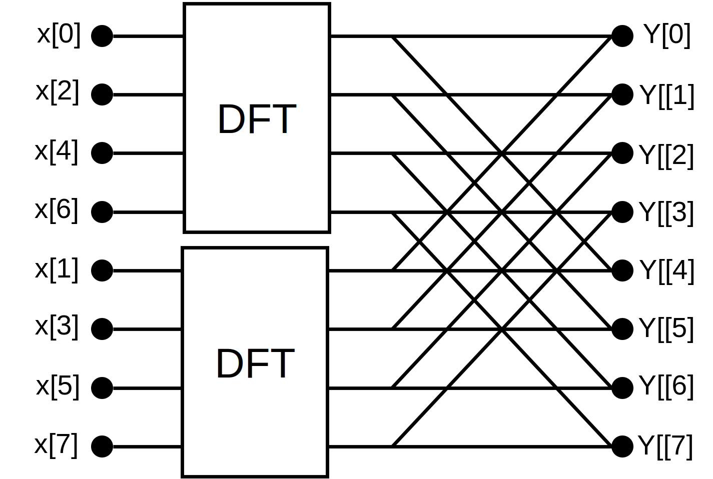
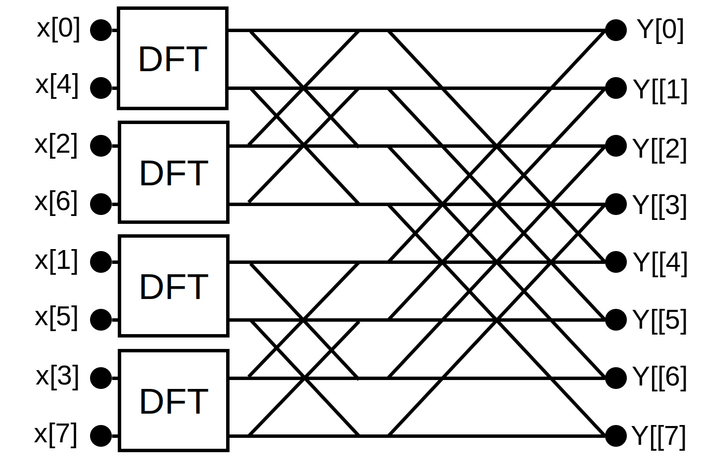

<script async src="https://cdn.jsdelivr.net/npm/mathjax@3/es5/tex-chtml.js" id="MathJax-script"></script>
<script>
MathJax = {
  tex: {
    inlineMath: [['$', '$'],['\\(', '\\)']]
  }
};
</script>


### 一维FFT

<b>核心原理</b>：通过$e^{-i\frac{2 \pi}{N}kt}$的对称性将DFT递归分解成若干小的DFT的组合。
原始的复杂度为$O(N^2)$的N输入N输出的DFT公式：

\\[ Y_N(k)=\sum_{t=0}^{N-1}  x(t) e^{-i\frac{2 \pi}{N}kt}\\]

IDFT公式为：

$$
 x(t)=\frac{1}{N}\sum_{k=0}^{N-1}  Y_N(k) e^{i\frac{2 \pi}{N}kt}
$$


这里只说明DFT的快速算法，IDFT和DFT只相差一个负号所以方法一样适用。
方便起见将$ e^{-i\frac{2 \pi}{N}kt} $记为$ W_{N}^{kt} $，注意到：
\\[W_{N}^{2kt} = W_{\frac{N}{2}}^{kt}\tag{1} \\]
\\[W_{N}^{kt} = W_{N}^{(k+N)t} = W_{N}^{k(t+N)}\tag{2}\\]
\\[W_{N}^{k+\frac{N}{2}} = -W_{N}^{k}\tag{3} \\]


使用公式(1)，我们可以将原始的DFT分解成仅包含偶数t和仅包含奇数t的两个部分的和：

$$
\begin{align}
Y_N(k)&=\sum_{t=0}^{N-1}  x(t) W_{N}^{kt} \\
&=\sum_{t=0}^{\frac{N}{2}-1}  x(2t) W_{N}^{2kt} +\sum_{t=0}^{\frac{N}{2}-1}  x(2t+1) W_{N}^{k(2t+1)}\\ 
&=\sum_{t=0}^{\frac{N}{2}-1}  x(2t) W_{N}^{2kt} +W_{N}^{k}\sum_{t=0}^{\frac{N}{2}-1}  x(2t+1) W_{N}^{2kt} \\
&=\underbrace{\sum_{t=0}^{\frac{N}{2}-1}  x(2t) W_{\frac{N}{2}}^{kt}}_{E} +W_{N}^{k}\underbrace{\sum_{t=0}^{\frac{N}{2}-1}  x(2t+1) W_{\frac{N}{2}}^{kt}}_{O}
\end{align} 
$$

其中，$E$部分相当于把相当于$x(t)$的偶数部分抽出来组成的长度为$\frac{N}{2}$的DFT，$O$部分相当于奇数部分组成的长度为$\frac{N}{2}$的DFT。由此，原始DFT被拆分成了两个一半大小的DFT：
\\[Y_N(k)=E_{\frac{N}{2}}(k)+W_{N}^{k}O_{\frac{N}{2}}(k)\tag{4}。\\]

同时，使用公式(2)可以发现：
\begin{eqnarray}
E_{\frac{N}{2}}(k+\frac{N}{2}) &=& E_{\frac{N}{2}}(k),\\
O_{\frac{N}{2}}(k+\frac{N}{2}) &=& O_{\frac{N}{2}}(k)。
\end{eqnarray}
再结合公式(3)可以发现：

\\[
Y_N(k+\frac{N}{2})=E_{\frac{N}{2}}(k)-W_{N}^{k}O_{\frac{N}{2}}(k)\tag{5}
\\]

公式(4)(5)说明，假设$N=8$，当使用$E_0～E_3,O_0～O_3$计算出$Y_0～Y_3$之后，可以复用这几个$E,O$来计算$Y_4～Y_7$而不用重新计算$E_4～E_7,O_4～O_7$。 
   
综上，只要分别计算出两个$\frac{N}{2}$长度的DFT，就可以通过公式(4)(5)确定$N$长度的DFT了，当$N=8$时可以画出如下的图：



进一步，每个$N=4$的DFT又各自可以拆分成两个$N=2$的DFT：



每个$N=2$的DFT又各自可以拆分成两个$N=1$的DFT：


对于$N=2^n$的情况，总共被分为$log_2{N}$层，每层进行$N$次加法乘法，因此总体的复杂度为$O(Nlog{N})$。

对应的代码如下：

```C++
#include <math.h>
#include <complex>

typedef std::complex<double> complexd;

complexd W(double N, double k)
{
    return std::pow(M_E, -complexd(0, 2 * M_PI * k / N));
}

void FFT(double* x, complexd* y, int len)
{
    if(len == 1) y[0] = x[0] * W(1, 0);
    else
    {
        double* x_even = new double[len / 2];
        double* x_odd = new double[len / 2];
        complexd* E = new complexd[len / 2];
        complexd* O = new complexd[len / 2];
        for(int k = 0; k < len / 2; k++)
        {
            x_even[k] = x[2 * k];
            x_odd[k] = x[2 * k + 1];
        }
        FFT(x_even, E, len / 2);
        FFT(x_odd, O, len / 2);
        for(int k = 0; k < len / 2; k++)
        {
            complexd w = W(len, k);
            y[k] = E[k] + w * O[k];
            y[len / 2 + k] = E[k] - w * O[k];
        }
    }
}

void DFT(double* x, complexd* y, int len)
{
    for(int k = 0; k < len; k++)
    {
        complexd res(0,0);
        for(int n = 0; n < len; n++)
        {
            res += x[n] * W(len, k * n);
        }
        y[k] = res;
    }
}

int main(int argc, char* argv[])
{
    int N = 32;
    if(argc > 1) N = std::atoi(argv[1]);
    printf("fft_1d(N=%d)\n",N);
    double* x = new double[N];
    for(int i = 0; i < N; i++)
    {
        x[i] = drand48();
    }
    complexd* y1 = new complexd[N];
    DFT(x, y1, N);
    complexd* y2 = new complexd[N];
    FFT(x, y2, N);
    double err = 0.0f;
    for(int i = 0; i < N; i++)
    {
        err += std::norm(y1[i] - y2[i]);
    }
    printf("error = %.8f\n", err);
    return 0;
}
```
[code](https://github.com/jooooow/fft)

### n维FFT

可以分解成n个1维的FFT，在每个的维度上进行1d-FFT。
考虑3d-FFT，需要分别在x,y,z轴上进行1d-FFT。
对于distributed memory类型的并行系统，为了保证数据的局部性，需要将当前维度的数据存储在结点内部。因此，当切换到另一个轴上计算之前，需要对矩阵进行转置：


然而这样的转置需要all-to-all的通信，继而当结点数增加到一定值时会产生通信的瓶颈。对于这个问题有一些trick可以缓解：

1. FFTW, [http://www.fftw.org/parallel/parallel-fftw.html](http://www.fftw.org/parallel/parallel-fftw.html)
2. Hess, Berk, et al. "GROMACS 4: algorithms for highly efficient, load-balanced, and scalable molecular simulation." Journal of chemical theory and computation 4.3 (2008): 435-447.

<script src="https://utteranc.es/client.js"
        repo="jooooow/jooooow.github.io"
        issue-term="pathname"
        theme="github-light"
        crossorigin="anonymous"
        async>
</script>