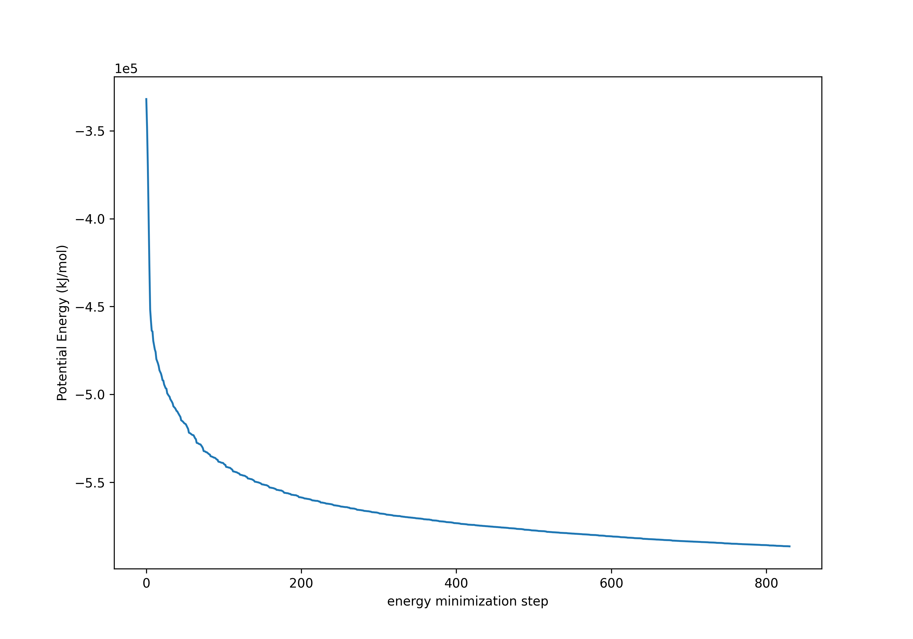
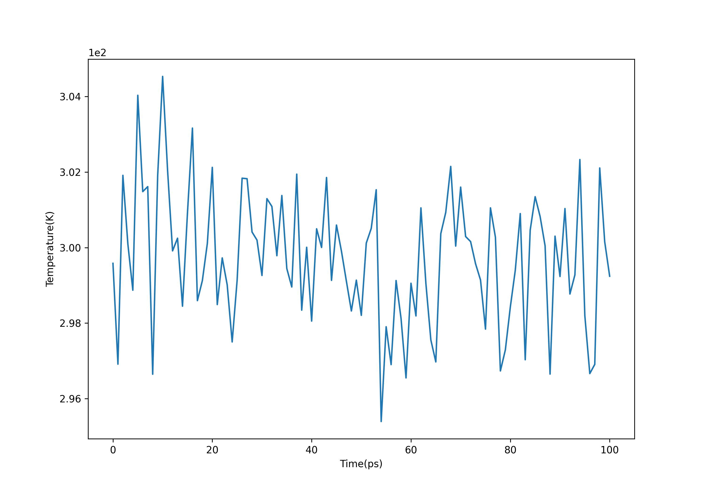
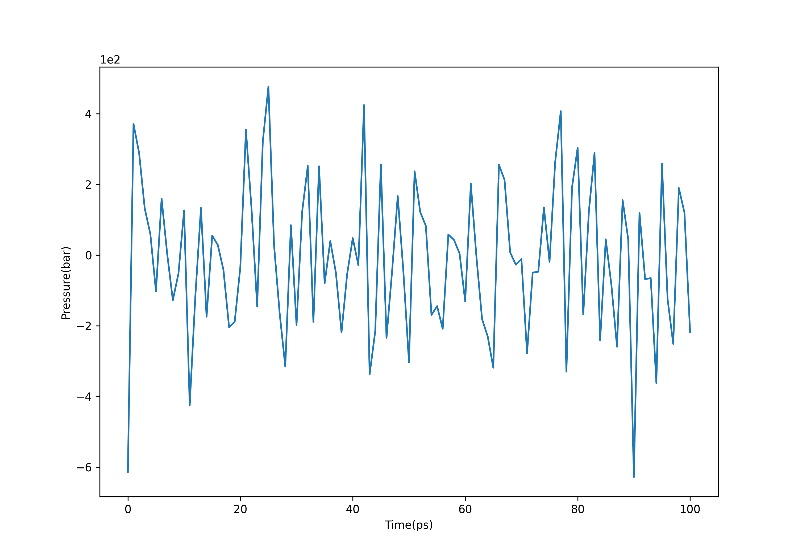
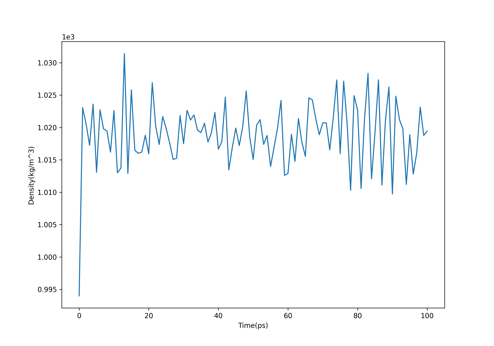
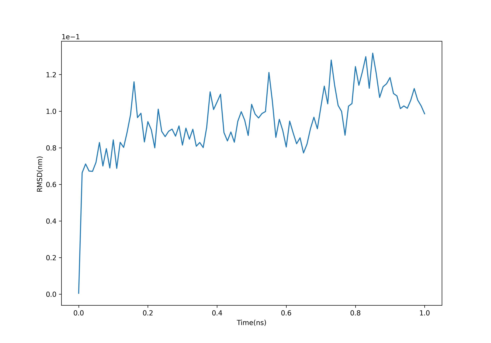
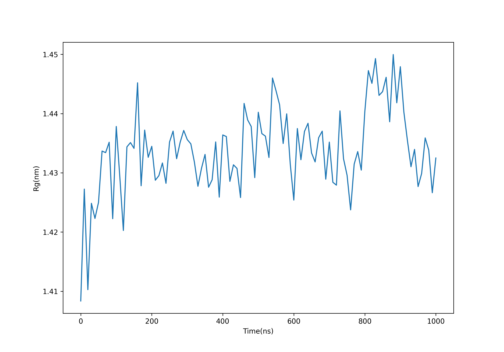

+ 主要参考[官方推荐的第三方教程](http://www.mdtutorials.com/gmx/lysozyme/index.html)
+ 基于GROMACS 2023.2

## 1.准备蛋白质结构文件

（1） 将下载的[pdb文件](https://www.rcsb.org/)中的结晶水去除（即，删除所有包含"HOH"的行）
```bash
grep -v HOH 1aki.pdb > 1AKI_clean.pdb
```
（2）指定使用的水模型，生成GROMACS可用的拓扑文件
```bash
gmx pdb2gmx -f 1AKI_clean.pdb -o 1AKI_processed.gro -water spce
```
选择OPLS力场，之后会生成：

+ 拓扑结构文件：topol.top
+ 处理后的gromos87格式的分子结构文件：1AKI_processed.gro
+ 位置约束文件：posre.itp

## 2. 生成模拟盒子
分子模拟时常使用周期边界条件来消除真空模拟带来的误差，通常做法是使用递归复制的单元盒子(unit cell)。因此此步骤需要将蛋白质放入初始的单元盒子，并且设置margin来避免计算自身的作用。  
（1）将蛋白质对于盒子居中（-c），并且设置距离盒子边缘1nm（-d 1.0），使用立方体盒子（-bt cubic）
```bash
gmx editconf -f 1AKI_processed.gro -o 1AKI_newbox.gro -c -d 1.0 -bt cubic
```
此时生成的1AKI_newbox.gro就是将上一步生成的1AKI_processed.gro的原子位置的偏移之后的结果。
## 3. 添加水溶液
往盒子里添加水分子：
```bash
gmx solvate -cp 1AKI_newbox.gro -cs spc216.gro -o 1AKI_solv.gro -p topol.top
```
spc216.gro为gromacs内置的水分子模型文件，
此时生成的1AKI_solv.gro与1AKI_newbox.gro相比，原子数从1960增加到33892个，也就是说添加了(33895-1963)/3=10644个水分子，这点可以从topol.top文件末尾被追加的SOL来确定：
```bash
[ molecules ]
; Compound        #mols
Protein_chain_A     1
SOL             10644
```

## 4. 电中性化
为了保持溶液整体的电中性，需要添加一定数量的离子。  
（1）首先生成执行电中性化所需的tpr文件
```bash
gmx grompp -f ions.mdp -c 1AKI_solv.gro -p topol.top -o ions.tpr
```
ions.mdp文件如下：
```bash
; ions.mdp - used as input into grompp to generate ions.tpr
; Parameters describing what to do, when to stop and what to save
integrator  = steep         ; Algorithm (steep = steepest descent minimization)
emtol       = 1000.0        ; Stop minimization when the maximum force < 1000.0 kJ/mol/nm
emstep      = 0.01          ; Minimization step size
nsteps      = 50000         ; Maximum number of (minimization) steps to perform

; Parameters describing how to find the neighbors of each atom and how to calculate the interactions
nstlist         = 1         ; Frequency to update the neighbor list and long range forces
cutoff-scheme	= Verlet    ; Buffered neighbor searching 
ns_type         = grid      ; Method to determine neighbor list (simple, grid)
coulombtype     = cutoff    ; Treatment of long range electrostatic interactions
rcoulomb        = 1.0       ; Short-range electrostatic cut-off
rvdw            = 1.0       ; Short-range Van der Waals cut-off
pbc             = xyz       ; Periodic Boundary Conditions in all 3 dimensions
```
（2）执行电中性化

gromacs的做法是将一定数量的水分子替换成离子来实现电中性。-pname指定使用钠作为正离子，-nname指定氯作为负离子 -neutral指定最终结果为中性：
```bash
gmx genion -s ions.tpr -o 1AKI_solv_ions.gro -p topol.top -pname NA -nname CL -neutral
```
选择SOL。观察topol.top文件的末尾SOL和CL的数量变化，可以确定8个水分子被替换成了CL离子：
```bash
[ molecules ]
; Compound        #mols
Protein_chain_A     1
SOL         10636
CL               8
```

## 5. 能量最小化
初始的原子位置是随机的，如果直接开始模拟可能会产生原子距离过近而崩溃之类的问题，因此在正式模拟之前需要将整体的势能尽可能减小。  
（1）生成执行最小化能量需要的tpr文件：
```bash
gmx grompp -f minim.mdp -c 1AKI_solv_ions.gro -p topol.top -o em.tpr
```
minim.mdp文件如下：
```bash
; minim.mdp - used as input into grompp to generate em.tpr
; Parameters describing what to do, when to stop and what to save
integrator  = steep         ; Algorithm (steep = steepest descent minimization)
emtol       = 1000.0        ; Stop minimization when the maximum force < 1000.0 kJ/mol/nm
emstep      = 0.01          ; Minimization step size
nsteps      = 50000         ; Maximum number of (minimization) steps to perform

; Parameters describing how to find the neighbors of each atom and how to calculate the interactions
nstlist         = 1         ; Frequency to update the neighbor list and long range forces
cutoff-scheme   = Verlet    ; Buffered neighbor searching
ns_type         = grid      ; Method to determine neighbor list (simple, grid)
coulombtype     = PME       ; Treatment of long range electrostatic interactions
rcoulomb        = 1.0       ; Short-range electrostatic cut-off
rvdw            = 1.0       ; Short-range Van der Waals cut-off
pbc             = xyz       ; Periodic Boundary Conditions in all 3 dimensions
```
（2）执行能量最小化：
```bash
gmx mdrun -v -deffnm em
```
（3）观察势能的变化：
```bash
gmx energy -f em.edr -o potential.xvg #选择potential
```
输出势能数据到xvg文件。
通常可以使用Xmgrace等，不过numpy也可以直接读取xvg文件：
```python
import matplotlib.pyplot as plt
import numpy as np
from matplotlib.pyplot import figure
x,y = np.loadtxt("potential.xvg",comments=["@", "#"],unpack=True)
figure(figsize=(10, 7), dpi=100)
plt.ticklabel_format(axis='y', style='sci', scilimits=(0,0))
plt.ylabel("Potential Energy(kJ/mol)")
plt.xlabel("energy minimization step")
plt.plot(x,y)
plt.savefig("potential.png", format="png", dpi=300)
```
获得如下的势能变化曲线，可以看出势能逐渐趋近于最小值：


## 6. 平衡化
正式模拟前的最后一个步骤是执行平衡化，包括NVT平衡和NPT平衡。  

（1）NVT(number-volume-temperature)平衡通过控制等温等容将系统温度调整到设定温度
```bash
gmx grompp -f nvt.mdp -c em.gro -r em.gro -p topol.top -o nvt.tpr
gmx mdrun -deffnm nvt
```
nvt.mdp文件如下，参考温度为300K：
```bash
title                   = OPLS Lysozyme NVT equilibration 
define                  = -DPOSRES  ; position restrain the protein
; Run parameters
integrator              = md        ; leap-frog integrator
nsteps                  = 50000     ; 2 * 50000 = 100 ps
dt                      = 0.002     ; 2 fs
; Output control
nstxout                 = 500       ; save coordinates every 1.0 ps
nstvout                 = 500       ; save velocities every 1.0 ps
nstenergy               = 500       ; save energies every 1.0 ps
nstlog                  = 500       ; update log file every 1.0 ps
; Bond parameters
continuation            = no        ; first dynamics run
constraint_algorithm    = lincs     ; holonomic constraints 
constraints             = h-bonds   ; bonds involving H are constrained
lincs_iter              = 1         ; accuracy of LINCS
lincs_order             = 4         ; also related to accuracy
; Nonbonded settings 
cutoff-scheme           = Verlet    ; Buffered neighbor searching
ns_type                 = grid      ; search neighboring grid cells
nstlist                 = 10        ; 20 fs, largely irrelevant with Verlet
rcoulomb                = 1.0       ; short-range electrostatic cutoff (in nm)
rvdw                    = 1.0       ; short-range van der Waals cutoff (in nm)
DispCorr                = EnerPres  ; account for cut-off vdW scheme
; Electrostatics
coulombtype             = PME       ; Particle Mesh Ewald for long-range electrostatics
pme_order               = 4         ; cubic interpolation
fourierspacing          = 0.16      ; grid spacing for FFT
; Temperature coupling is on
tcoupl                  = V-rescale             ; modified Berendsen thermostat
tc-grps                 = Protein Non-Protein   ; two coupling groups - more accurate
tau_t                   = 0.1     0.1           ; time constant, in ps
ref_t                   = 300     300           ; reference temperature, one for each group, in K
; Pressure coupling is off
pcoupl                  = no        ; no pressure coupling in NVT
; Periodic boundary conditions
pbc                     = xyz       ; 3-D PBC
; Velocity generation
gen_vel                 = yes       ; assign velocities from Maxwell distribution
gen_temp                = 300       ; temperature for Maxwell distribution
gen_seed                = -1        ; generate a random seed
```
观察温度变化，可以发现温度大致稳定在300K附近：
```bash
gmx energy -f nvt.edr -o temperature.xvg #选择16
```

（2）NPT(number-pressure-temperature)平衡通过控制等温等压将系统压强调整到设定压强：
```bash
gmx grompp -f npt.mdp -c nvt.gro -r nvt.gro -t nvt.cpt -p topol.top -o npt.tpr
gmx mdrun -deffnm npt
```
npt.mdp文件如下，参考压强为1.0bar：
```bash
title                   = OPLS Lysozyme NPT equilibration 
define                  = -DPOSRES  ; position restrain the protein
; Run parameters
integrator              = md        ; leap-frog integrator
nsteps                  = 50000     ; 2 * 50000 = 100 ps
dt                      = 0.002     ; 2 fs
; Output control
nstxout                 = 500       ; save coordinates every 1.0 ps
nstvout                 = 500       ; save velocities every 1.0 ps
nstenergy               = 500       ; save energies every 1.0 ps
nstlog                  = 500       ; update log file every 1.0 ps
; Bond parameters
continuation            = yes       ; Restarting after NVT 
constraint_algorithm    = lincs     ; holonomic constraints 
constraints             = h-bonds   ; bonds involving H are constrained
lincs_iter              = 1         ; accuracy of LINCS
lincs_order             = 4         ; also related to accuracy
; Nonbonded settings 
cutoff-scheme           = Verlet    ; Buffered neighbor searching
ns_type                 = grid      ; search neighboring grid cells
nstlist                 = 10        ; 20 fs, largely irrelevant with Verlet scheme
rcoulomb                = 1.0       ; short-range electrostatic cutoff (in nm)
rvdw                    = 1.0       ; short-range van der Waals cutoff (in nm)
DispCorr                = EnerPres  ; account for cut-off vdW scheme
; Electrostatics
coulombtype             = PME       ; Particle Mesh Ewald for long-range electrostatics
pme_order               = 4         ; cubic interpolation
fourierspacing          = 0.16      ; grid spacing for FFT
; Temperature coupling is on
tcoupl                  = V-rescale             ; modified Berendsen thermostat
tc-grps                 = Protein Non-Protein   ; two coupling groups - more accurate
tau_t                   = 0.1     0.1           ; time constant, in ps
ref_t                   = 300     300           ; reference temperature, one for each group, in K
; Pressure coupling is on
pcoupl                  = Parrinello-Rahman     ; Pressure coupling on in NPT
pcoupltype              = isotropic             ; uniform scaling of box vectors
tau_p                   = 2.0                   ; time constant, in ps
ref_p                   = 1.0                   ; reference pressure, in bar
compressibility         = 4.5e-5                ; isothermal compressibility of water, bar^-1
refcoord_scaling        = com
; Periodic boundary conditions
pbc                     = xyz       ; 3-D PBC
; Velocity generation
gen_vel                 = no        ; Velocity generation is off 
```
观察压强变化，可以发现压强虽然波动很大，但是总体在1.0bar附近波动：
```bash
gmx energy -f npt.edr -o pressure.xvg #选择18
```

（3）观察密度变化

整体的密度大致在1.018kg/m^3附近波动，和室温中的水的密度(1kg/m^3)以及SPC/E水的密度(1.008kg/m^3)基本一致：
```bash
gmx energy -f npt.edr -o density.xvg #选择24
```


## 7. 正式模拟
```bash
gmx grompp -f md.mdp -c npt.gro -t npt.cpt -p topol.top -o md_0_1.tpr
gmx mdrun -deffnm md_0_1
```
md.mdp文件如下：
```bash
title                   = OPLS Lysozyme NPT equilibration 
; Run parameters
integrator              = md        ; leap-frog integrator
nsteps                  = 500000    ; 2 * 500000 = 1000 ps (1 ns)
dt                      = 0.002     ; 2 fs
; Output control
nstxout                 = 0         ; suppress bulky .trr file by specifying 
nstvout                 = 0         ; 0 for output frequency of nstxout,
nstfout                 = 0         ; nstvout, and nstfout
nstenergy               = 5000      ; save energies every 10.0 ps
nstlog                  = 5000      ; update log file every 10.0 ps
nstxout-compressed      = 5000      ; save compressed coordinates every 10.0 ps
compressed-x-grps       = System    ; save the whole system
; Bond parameters
continuation            = yes       ; Restarting after NPT 
constraint_algorithm    = lincs     ; holonomic constraints 
constraints             = h-bonds   ; bonds involving H are constrained
lincs_iter              = 1         ; accuracy of LINCS
lincs_order             = 4         ; also related to accuracy
; Neighborsearching
cutoff-scheme           = Verlet    ; Buffered neighbor searching
ns_type                 = grid      ; search neighboring grid cells
nstlist                 = 10        ; 20 fs, largely irrelevant with Verlet scheme
rcoulomb                = 1.0       ; short-range electrostatic cutoff (in nm)
rvdw                    = 1.0       ; short-range van der Waals cutoff (in nm)
; Electrostatics
coulombtype             = PME       ; Particle Mesh Ewald for long-range electrostatics
pme_order               = 4         ; cubic interpolation
fourierspacing          = 0.16      ; grid spacing for FFT
; Temperature coupling is on
tcoupl                  = V-rescale             ; modified Berendsen thermostat
tc-grps                 = Protein Non-Protein   ; two coupling groups - more accurate
tau_t                   = 0.1     0.1           ; time constant, in ps
ref_t                   = 300     300           ; reference temperature, one for each group, in K
; Pressure coupling is on
pcoupl                  = Parrinello-Rahman     ; Pressure coupling on in NPT
pcoupltype              = isotropic             ; uniform scaling of box vectors
tau_p                   = 2.0                   ; time constant, in ps
ref_p                   = 1.0                   ; reference pressure, in bar
compressibility         = 4.5e-5                ; isothermal compressibility of water, bar^-1
; Periodic boundary conditions
pbc                     = xyz       ; 3-D PBC
; Dispersion correction
DispCorr                = EnerPres  ; account for cut-off vdW scheme
; Velocity generation
gen_vel                 = no        ; Velocity generation is off 
```

## 8.分析
（1）去除周期边界条件
```bash
gmx trjconv -s md_0_1.tpr -f md_0_1.xtc -o md_0_1_noPBC.xtc -pbc mol -center #选择1.protein
```
（2）计算RMSD
```bash
gmx rms -s md_0_1.tpr -f md_0_1_noPBC.xtc -o rmsd.xvg -tu ns #选择4.backbone
```

可以发现RMSD逐渐趋于0.1nm附近，这个足够小的值表明了蛋白质结构很稳定。  
（3）计算回旋半径
```bash
gmx gyrate -s md_0_1.tpr -f md_0_1_noPBC.xtc -o gyrate.xvg #选择1.protein
```

可以发现回旋半径逐渐趋于一个稳定的值，表明蛋白质可以稳定地保持折叠。  

（4）可视化

[PyMol可视化的模拟轨迹](http://www.jooooow.com/static/video/lysozyme.mpg)

<script src="https://utteranc.es/client.js"
        repo="jooooow/jooooow.github.io"
        issue-term="pathname"
        theme="github-light"
        crossorigin="anonymous"
        async>
</script>