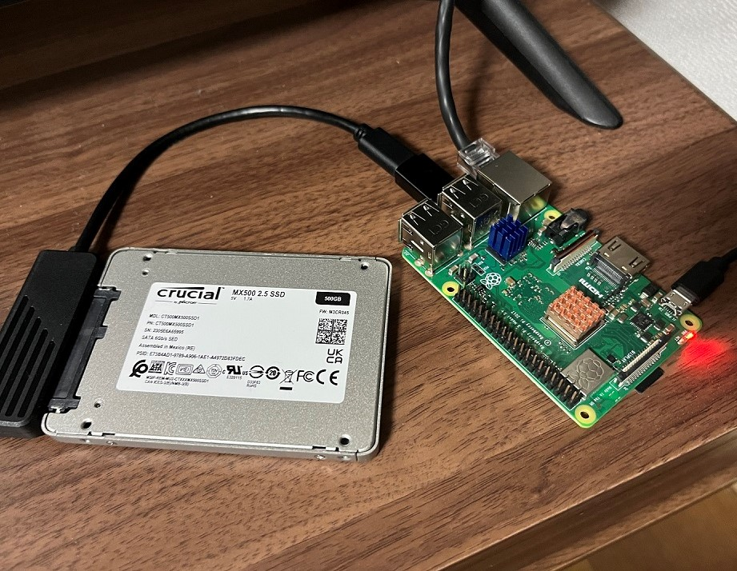
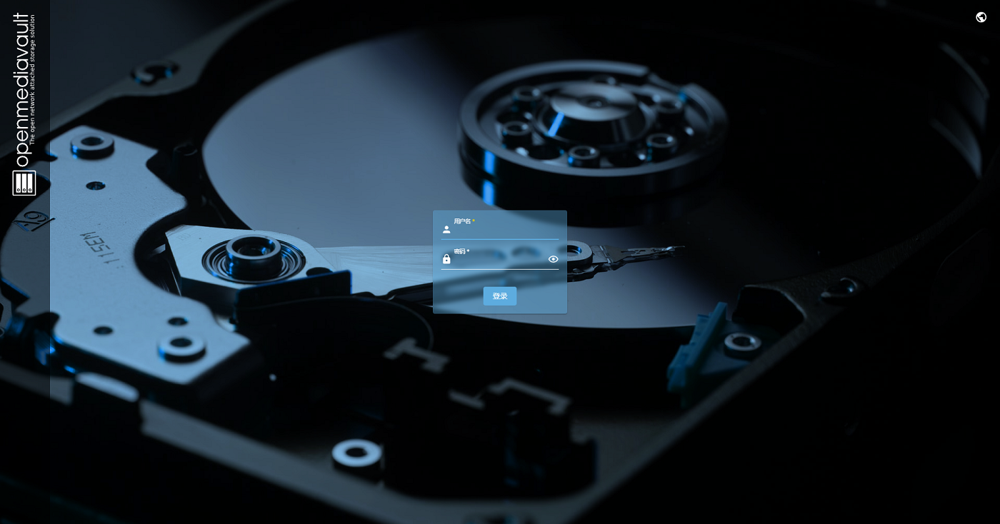
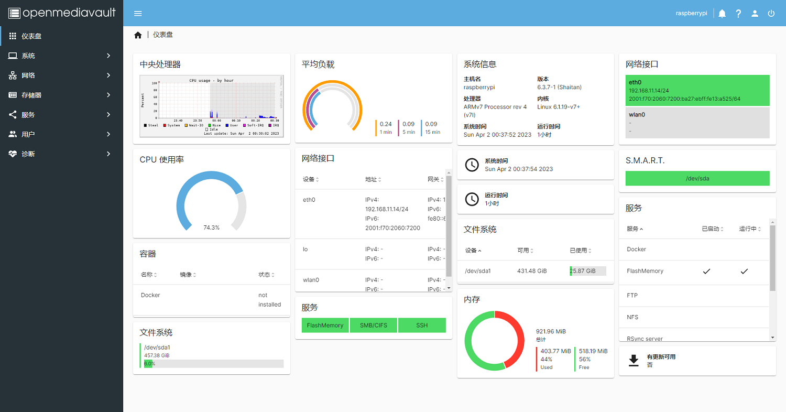
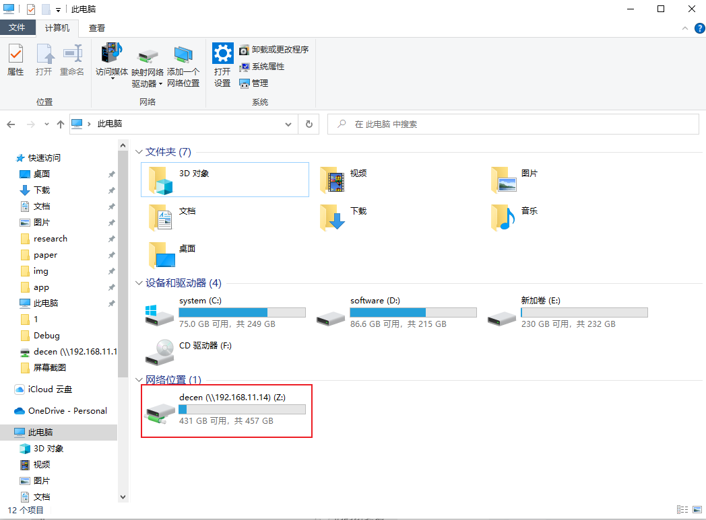
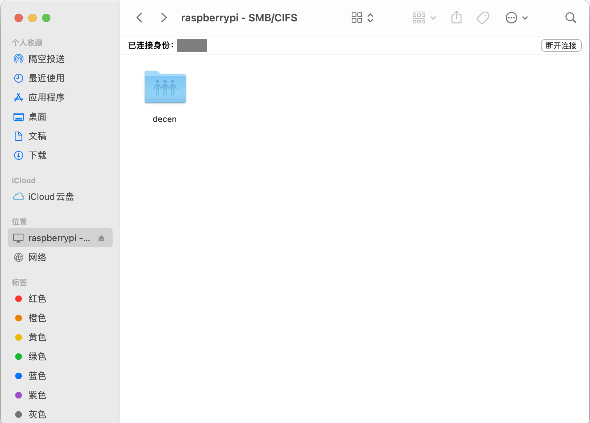
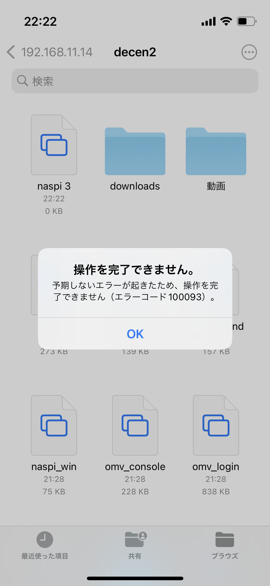
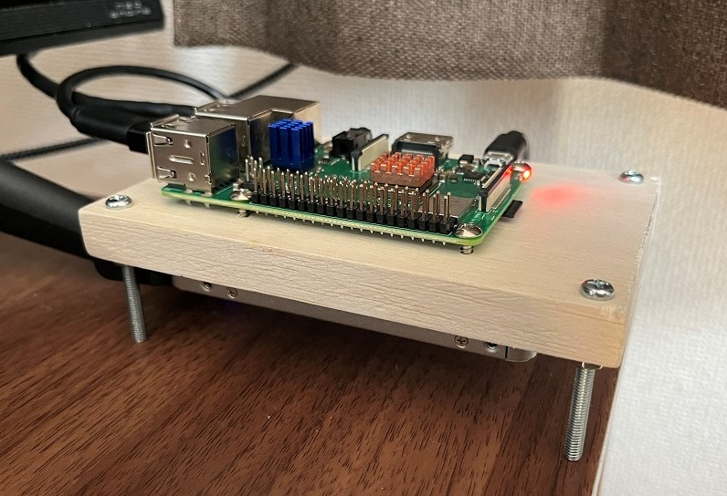

<script async src="https://cdn.jsdelivr.net/npm/mathjax@3/es5/tex-chtml.js" id="MathJax-script"></script>
<script>
MathJax = {
  tex: {
    inlineMath: [['$', '$'],['\$', '\$']]
  }
};
</script>

手头有闲置的pi，就想着用OpenMediaVault(OMV)搭个NAS试试看。

### 材料
1. 树莓派3B+*1  
2. microSD卡*1  
3. SSD*1  
4. SATA转usb线*1  
5. 网线*1  

### step.1

由于需要lite的Debian，所以就用raspberry pi os lite了，使用官方自带的软件写入SD卡：
[https://www.raspberrypi.com/software/](https://www.raspberrypi.com/software/)

### step.2
由于pi 4才开始内置pcie，所以手头的3目前只能用sata转usb的方法连接：


### step.3
系统装好后，使用官方脚本安装OMV：[https://github.com/OpenMediaVault-Plugin-Developers/installScript/](https://github.com/OpenMediaVault-Plugin-Developers/installScript/)  
安装成功后会自动重启，并且重启之后IP会发生变化。我遇到的情况是重启后无法使用无线网，只能插网线了。  

### step.4

浏览器输入ip地址，就会出现OMV的界面：

默认用户名admin，密码openmediavault。
之后按照：  

1. 清理/挂载磁盘    
2. 创建文件系统  
3. 创建共享文件夹  
4. 配置SMB/CIFS服务  
5. 添加用户

的流程来配置NAS服务，完成之后：
  

### step.5

配置结束后同一局域网下的设备就可以访问共享文件夹了。  
```windows```  : 资源浏览器访问\\\\\192.168.xxx.xxx，可以顺便映射网络驱动器方便以后访问：
  
```macos```   : finder->前往->连接服务器，输入ip地址连接即可：
  
```ios/ipados```  : 文件->连接服务器，输入ip地址连接。
不过这里遇到一个问题，这两个平台下只能删除文件和新建文件夹，不能做任何的上传和复制粘贴操作，使用第三方ES就可以：



按照网上查到的conf里加fruit的方法不起作用，据说这是14.5之后出现的bug。macos上的这个bug最近被修掉了，不知道ios/ipados上的什么时候能修修。

### step.6

omv-extras中安装docker和portainer之后便可以用docker了。
装了个qbittorrent用作下载器，按照网上的博客操作都大同小异。
不过有一个问题，和qbittorrent的downloads目录映射的host的目录的所有者会发生变化，导致本地连接时因为权限问题导致无法修改下载好的文件。解决办法是添加PUID和PGID环境变量到docker上，PUID和PGID可以用id [username]的指令查看，之后重新deploy，目录的所有者就会变成username。
参考自官方说明：[https://hub.docker.com/r/linuxserver/qbittorrent](https://hub.docker.com/r/linuxserver/qbittorrent)

### 其他
1.虽然有点不完美，单总归是实现了设备间的文件互通，用一段时间后考虑加块ssd做冗余备份。  
2.按照东京电价，一年电费约在2000~2500之间：

\[ (0.6A+1.6A) \times 5V \times 24h \times 30d \times 12m \times 0.0001 \times 25(円)=2376(円) \]


3.得想办法搞个壳子。  

### 追记
**2023/4/2**   : 木板做了个丐版支架，上面螺丝固定pi，下面3M胶贴着SSD，四周四个螺丝做支撑：
    
先凑合着用。

<script src="https://utteranc.es/client.js"
        repo="jooooow/jooooow.github.io"
        issue-term="pathname"
        theme="github-light"
        crossorigin="anonymous"
        async>
</script>