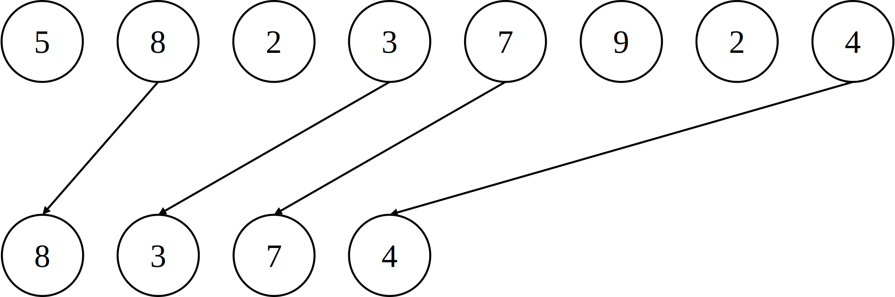

假设存在以下的数组：

$$
\begin{matrix}
idx:0 & 1 & 2 & 3 & 4 & 5 & 6 & 7\\
arr:5 & 8 & 2 & 3 & 7 & 9 & 2 & 4
\end{matrix}
$$

想将\(arr[1]\)，\(arr[3]\)，\(arr[4]\)，\(arr[7]\)抽出并按照原来的顺序组成新的数组:

$$
\begin{matrix}
idx:0 & 1 & 2 & 3\\
arr:8 & 3 & 7 & 4 
\end{matrix}
$$

存在如下的并行算法：

### step.1

建立\(flg\)数组，将希望抽出的位置1，其余置0

$$
\begin{matrix}
idx:0 & 1 & 2 & 3 & 4 & 5 & 6 & 7\\
arr:5 & 8 & 2 & 3 & 7 & 9 & 2 & 4\\
flg:0 & 1 & 0 & 1 & 1 & 0 & 0 & 1
\end{matrix}
$$

### step.2

对\(flg\)数组进行(并行)前缀和

$$
\begin{matrix}
idx:0 & 1 & 2 & 3 & 4 & 5 & 6 & 7\\
arr:5 & 8 & 2 & 3 & 7 & 9 & 2 & 4\\
flg:0 & 1 & 1 & 2 & 3 & 3 & 3 & 4
\end{matrix}
$$

### step.3

第\(i\)个线程检查\(flg\)数组的第\(i\)位与第\(i-1\)位，如果不一致，则按照\(res[flg[i]-1]=arr[i]\)写入\(res\)

$$
\begin{matrix}
idx:0 & 1 & 2 & 3 & 4 & 5 & 6 & 7\\
arr:5 & 8 & 2 & 3 & 7 & 9 & 2 & 4\\
flg:0 & 1 & 1 & 2 & 3 & 3 & 3 & 4\\
res:8 & 3 & 7 & 4
\end{matrix}
$$

